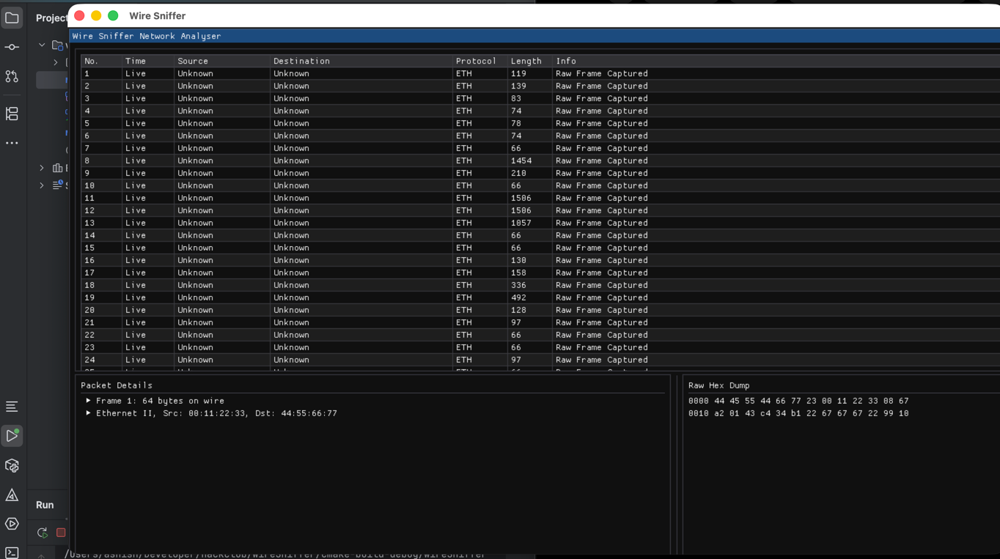
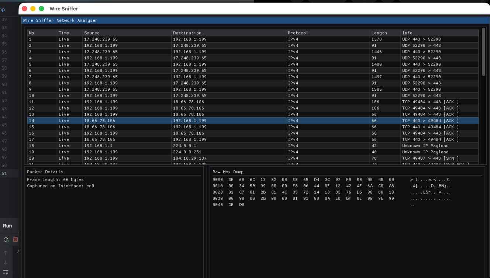

# Devlog 1
i have setup basic project
## UI Framwework
- QT -> this felt too heavy for techy spy website, also i dont need this much of features and its compilation process, i read it twice and still it went above my head
- dear imgui -> this is light weight and its a immediate mode ui, something which i treid to learn last time when i build a CHIP8-Emulator

- i also used GLFW to create windows and handle I/O

> thats all, till next devlog i plan to remove th demo UI of dear imgui, and implement a simple placeholder UI

# Devlog 2

- ## Improved UI Layout
- Layout sections can now be resized will work later on making them responsive automatically

- Now this UI rendering is different from websites rendering
- here the whole UI is erased and redrawn 60 times every second, and i i put a blocking process in this UI loop, the my ui will become unresponsive
- to fix this i used thread to run the monitoring of network in background
- used std::mutex to prevent read and write happening at same time
- libpcap is used to process the packets in batches

> next, i would like to make ui more responsive and display more information about the packets and network

# Devlog 3
These low level languages, they are fucking scary. I spent my like 90% of time debugging and understanding the theory behind this networks and specifically how libcap handles them, then writing actual code.  banging my head to AI to explain me these things.

## Heres what i got
- first of all i did a quick revison of pointer stuff as the libcap is usign that heavily
- Theres one thing i dont understand completely which is `#pragma pack(push, 1)` it is some deep memory thing, i read about it but did note really understand this, got AI help here
- used pointer arithmatics to extract the details of packet
- Also i found some cool things like big-endian and little endian, won't talk much about this, but i guess i feel like a network engineer already

### Well if you did not read the stuff above, Here's the cool thing in one line Right now, the UI properly displays IP addresses, exact ports, and connection details.

> I don't know what I'm gonna do next because it was a lot of time and researching and learning in last session so probably I will take a break and after that i wil just look into what else is there, i  guess there is a lot of still remaining network can't be easy, but let's see.

# Devlog 4

- refactored main.cpp to separate types in headers files CaptureHaeader.h and CaptureEngine.cpp,
### Hex Dump
- Heres the cool thing, now i display the hex dump as well
- it loops through the raw byte vector of the selected packet and prints it in the classic 16-byte offset format

- till now the UI and Logic were coupled together, i just seperated them in UIManger.h and UIManager.cpp file
> NEXT TARGET --> improve the UI and some network exploitation thing

# Devlog 5
This tool is still not feeling like a nearly illeagal spy tool, so decided to add somethign to interfare with network

## ARP Spoofer
- Address Resolution Protocol (ARP) is the glue that binds IP addresses (Layer 3) to physical MAC addresses (Layer 2). When your phone wants to talk to the Wi-Fi router, it shouts out to the entire network: "Who has IP 192.168.1.1? Tell my MAC address."
- The router replies: "I do, my MAC is AA:BB:CC..."
- Because ARP was designed in the 1980s, it has zero authentication. If your Wire Sniffer blasts a fake reply to a victim's phone saying, "Hey, I am 192.168.1.1 (the router), my MAC is [Your Laptop's MAC]", the victim's phone will blindly believe it. It will instantly overwrite its internal routing table and start sending all its internet traffic to you instead of the actual router.

# And here is OUR ARP SPOOFER
- so basically we build a raw packet byte by byte and fire it with `pcap_inject()`

- ok, so i failed to build this AR spoofer for now because it is way more complex than I thought it is as I don't have much time for this project, so I will be completing other features and I will come back to this feature if I have some time left
