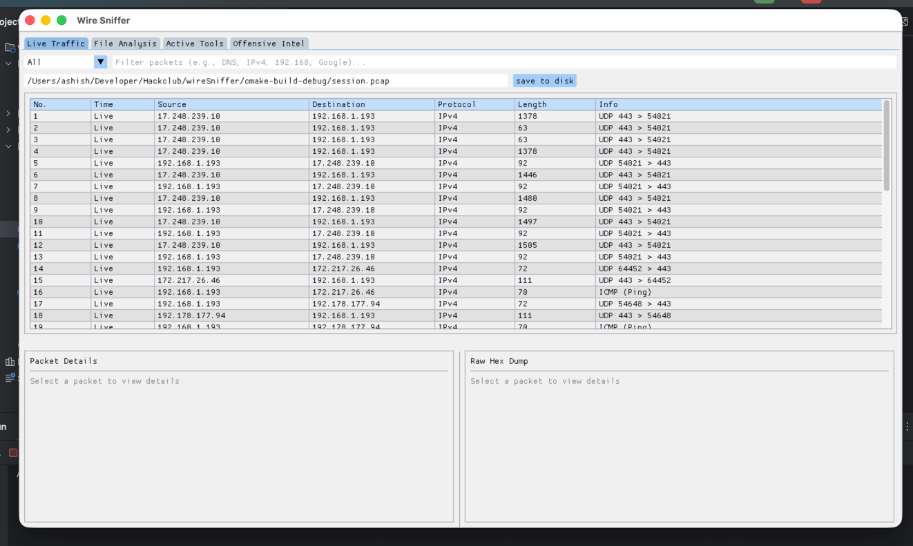

# wireSniffer
wireSniffer is high performance, system level network analyzer built entirely in C++

### If you want project specifications and details please read (DEVLOG.md)(./DEVLOG.ms)

# Features
- Data Exfiltration Engine: Real-time extraction and plaintext of TCP payloads (HTTP/DNS), automatically masking binary noise to reveal intercepted targets.
- Offensive Intel Module: Detects a Nmap Scan , could also perform one , but i had to cut on time so for now its just simulating that.
- Session Logging: Full .pcap file I/O operations it can dump live intercepts to disk or load historical captures for post-incident analysis.
- Automated CI/CD: fully automated release pipeline via GitHub Actions.

# Installation
Apple will flag my application as unsafe as i dont have $99 to buy apple developer pack and get verified

1. Download the latest release from the release section on the right side of the repo
2. extract the zip file and try to run the application (it wont run, but you must try once)
3. after this go to system setting and under privacy and security scroll down to the bottom where you will the application name and optin to open anyay, click on that.
4. after this run the same application again, it will run
> This is the standard process of running small openSource applications

But as my app monitors network packets, it requires sudo previleges
so if you run the application normally it wont trace anything
so instead run the application with sudo
`sudo /Users/ashish/Downloads/WireSniffer`

### Tested on macOS Tahoe - 26, may or may not work on older version, i did not have much time to test.

## Installing Guide video
i can be difficult if you have never worked on mac before, or you are new to it, so heres a guide for isntallation

# Tech Stack
- C++
- Dear ImGui & DLFW -> for GUI
- libcap -> for capturing the packets and .pcap file I/O
- CMake and github actions

# AI
- no AI was used to write code externlly, ony the inline code sugestion i Clion IDE were used.

# Credits & Acknowledgements
- [Dear ImGui Docs](https://github.com/ocornut/imgui)
- [Programming with pcap guide](https://www.tcpdump.org/pcap.html)
- [Beej's Guide to Network Programming](https://beej.us/guide/bgnet/)
- Google Gemini -> Well not everything written in the documentation i can understand

